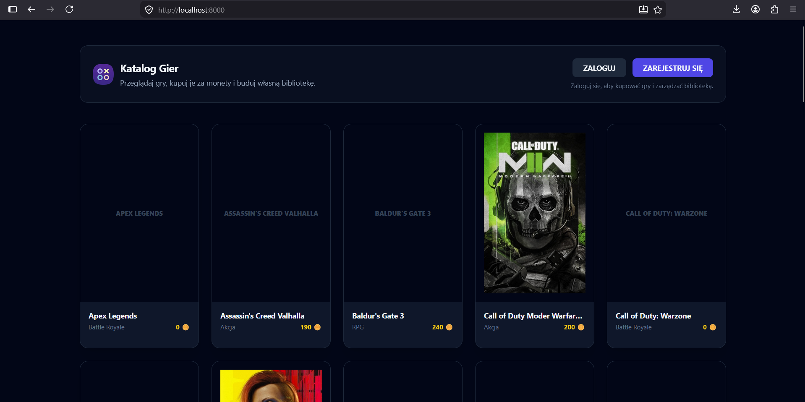
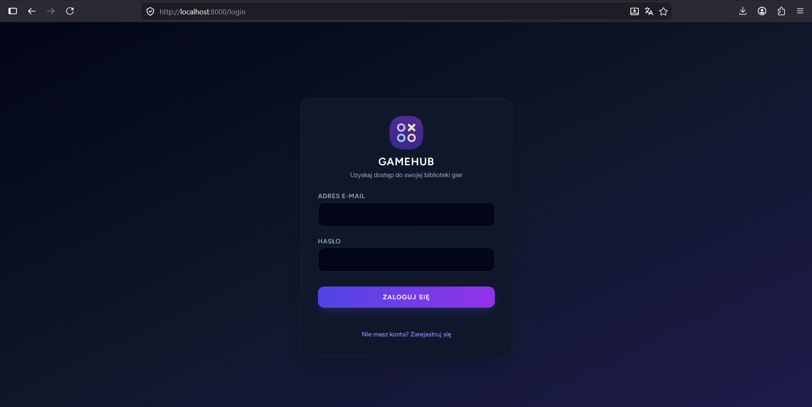
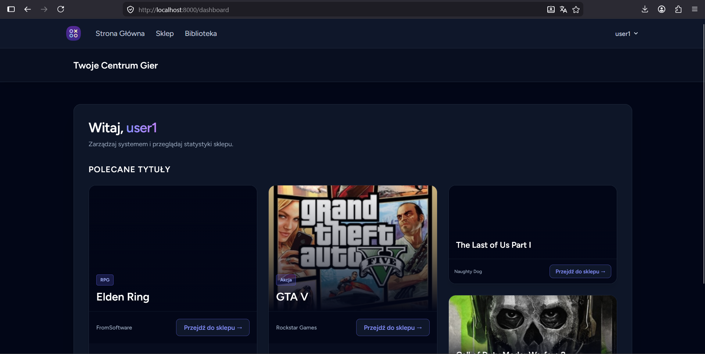

# Temat projektu

**GameHUB** to aplikacja internetowa służąca do przeglądania i kupowania gier komputerowych. Użytkownik może założyć konto, zalogować się, przeglądać katalog gier, kupować gry za monety oraz zarządzać swoją biblioteką. Administrator posiada panel zarządzania, w którym może dodawać, edytować i usuwać gry oraz zarządzać użytkownikami.

## Lista pytań pomocniczych

**Jaki problem rozwiązuje nasza aplikacja?**

Aplikacja pozwala w prosty sposób zarządzać cyfrowym katalogiem gier. Użytkownik nie musi pamiętać, które gry posiada, ponieważ wszystkie zakupione tytuły trafiają do jego biblioteki. System obsługuje również portfel z monetami, dzięki któremu można kupować gry i zwracać je po cenie zapisanej w momencie zakupu.

**Jeśli istnieją podobne rozwiązania, to czym nasza aplikacja się wyróżnia?**

GameHUB posiada prosty system zakupu gier za wirtualne monety oraz panel administratora do zarządzania bazą gier. Aplikacja zapamiętuje cenę zakupu, dlatego jeśli administrator później zmieni cenę gry, użytkownik przy zwrocie otrzyma dokładnie tyle monet, ile zapłacił wcześniej.

---

## Uruchomienie projektu (developer)

| Technologia | Dokładna wersja | Zastosowanie | Oficjalna strona |
| :--- | :--- | :--- | :--- |
| **PHP** | 8.5.6 | Backend aplikacji | [php.net](https://www.php.net/) |
| **Laravel** | 13.0 | Główny framework projektu | [laravel.com](https://laravel.com/) |
| **PostgreSQL** | 18.4 | Baza danych | [postgresql.org](https://www.postgresql.org/) |
| **Blade** | zintegrowany z Laravel 13.0 | Widoki HTML | [laravel.com/docs/blade](https://laravel.com/docs/blade) |
| **Tailwind CSS** | 3.1.0 | Stylowanie strony | [tailwindcss.com](https://tailwindcss.com/) |
| **Composer** | 2.9.8 | Zależności PHP | [getcomposer.org](https://getcomposer.org/) |
| **Node.js** | 24.15.0 | Środowisko frontendowe | [nodejs.org](https://nodejs.org/) |
| **npm** | 11.12.1 | Menedżer pakietów frontendowych | [npmjs.com](https://www.npmjs.com/) |
| **Vite** | 7.0.7 | Obsługa plików frontendowych | [vite.dev](https://vite.dev/) |

### Wymagania programowe

Do uruchomienia projektu na czystym komputerze potrzebne są:

* **System operacyjny:** Windows 10/11
* **PHP:** 8.5.6
* **Composer:** 2.9.8
* **PostgreSQL:** 18.4
* **Node.js:** 24.15.0
* **npm:** 11.12.1
* **Przeglądarka internetowa:** Google Chrome, Firefox, Edge lub Brave
* **Dodatkowe wymagania:** włączona obsługa JavaScript i plików cookie w przeglądarce

### Proces instalacji

Pobierz dostarczone archiwum z repozytorium `BN134953/aplikacje-internetowe.git` (`gamegub.7z`) i rozpakuj je w wybranym katalogu na swoim komputerze. Następnie otwórz terminal i przejdź do rozpakowanego folderu za pomocą komendy:

`cd sciezka-do-rozpakowanego-folderu`

Następnie przejdź do folderu aplikacji:

`cd biblioteka_gier`

Zainstaluj zależności PHP:

`composer install`

Zainstaluj zależności frontendowe:

`npm install`

### Proces konfiguracji

W pliku `.env` należy ustawić dane połączenia z bazą PostgreSQL, np.:

`DB_CONNECTION=pgsql`  
`DB_HOST=127.0.0.1`  
`DB_PORT=5432`  
`DB_DATABASE=biblioteka_gier`  
`DB_USERNAME=postgres`  
`DB_PASSWORD=admin`

Jeśli projekt nie ma jeszcze pliku `.env`, należy skopiować `.env.example` jako `.env` i wygenerować klucz aplikacji:

`php artisan key:generate`

Następnie należy uruchomić migracje, aby utworzyć strukturę bazy danych:

`php artisan migrate`

Opcjonalnie można uruchomić seedery, aby dodać przykładowe dane:

`php artisan db:seed`

### Dane początkowe

Domyślne konto administratora:

Login: `admin@gamehub.pl`  
Hasło: `zaq1@WSX`

Przykładowe konto użytkownika:

Login: `user1@gmail.com`  
Hasło: `zaq1@WSX`

Dodatkowo w bazie mogą znajdować się testowi użytkownicy:

Login: `user01@gamehub.pl` do `user30@gamehub.pl`  
Hasło: `zaq1@WSX`

### Uruchomienie projektu w terminalu

Aby uruchomić aplikację Laravel, wpisz:

`php artisan serve`

Aby uruchomić frontend Vite, wpisz w drugim terminalu:

`npm run dev`

Po poprawnym uruchomieniu aplikacja będzie dostępna w przeglądarce pod adresem:

`http://127.0.0.1:8000`

---

## Uruchomienie projektu (user)

Aplikacja działa lokalnie w przeglądarce internetowej. Nie została wdrożona publicznie w sieci, dlatego do korzystania z niej wymagane jest uruchomienie lokalnego serwera Laravel.

Adres aplikacji po uruchomieniu:

`http://127.0.0.1:8000`

Użytkownik końcowy nie musi znać kodu aplikacji. Wystarczy, że aplikacja zostanie uruchomiona przez developera lub osobę techniczną. Do korzystania potrzebna jest przeglądarka internetowa oraz działające połączenie z lokalną bazą danych.

Wymagania sprzętowe są niewielkie. Do płynnego działania wystarczy standardowy komputer z systemem Windows 10/11, dostępem do przeglądarki oraz uruchomioną lokalnie bazą PostgreSQL.

---

## Podręcznik użytkownika

### Role w systemie

W aplikacji występują dwie główne role:

* **Użytkownik / klient** - może przeglądać katalog gier, kupować gry za monety, zwracać zakupione gry, doładowywać portfel, korzystać z biblioteki oraz edytować swój profil.
* **Administrator** - może zarządzać katalogiem gier, dodawać nowe gry, edytować istniejące tytuły, usuwać gry oraz zarządzać użytkownikami.

Administrator widzi panel zarządzania, a zwykły użytkownik widzi sklep, bibliotekę i panel ze swoimi grami.

### Rejestracja

Na stronie głównej kliknij przycisk **ZAREJESTRUJ SIĘ**. Następnie wypełnij formularz, podając nazwę użytkownika, adres e-mail oraz hasło. Po utworzeniu konta użytkownik zostaje automatycznie przeniesiony do panelu głównego.

### Logowanie

Na stronie głównej kliknij przycisk **ZALOGUJ**. Wpisz adres e-mail oraz hasło. Po poprawnym zalogowaniu użytkownik trafia do swojego centrum gier.

### Katalog gier

Na stronie głównej widoczny jest katalog gier. Każda gra posiada tytuł, gatunek oraz cenę w monetach. Użytkownik niezalogowany może tylko przeglądać gry. Kupowanie wymaga zalogowania.

### Panel użytkownika

Po zalogowaniu użytkownik widzi panel z polecanymi grami. Polecane gry są losowane z bazy danych. Z panelu można przejść do sklepu lub do swojej biblioteki.

### Sklep

W sklepie użytkownik może wyszukiwać gry, filtrować je po gatunku oraz sortować według tytułu, ceny lub daty premiery. Zalogowany użytkownik widzi również swój portfel z monetami.

### Portfel

Użytkownik posiada portfel z monetami. Monety można doładować w sklepie. Służą one do kupowania gier.

### Kupowanie gry

Przy grze dostępny jest przycisk **KUP**. Po kliknięciu system sprawdza, czy użytkownik ma wystarczającą liczbę monet. Jeśli saldo jest wystarczające, cena gry zostaje odjęta od portfela, a gra trafia do biblioteki użytkownika.

### Zwracanie gry

Jeśli użytkownik posiada grę, może ją zwrócić. System oddaje tyle monet, ile użytkownik zapłacił w momencie zakupu. Zmiana ceny gry przez administratora nie wpływa na wartość zwrotu.

Przykład: jeśli użytkownik kupił grę za `100` monet, a administrator później zmienił cenę na `200`, to przy zwrocie użytkownik otrzyma `100` monet.

### Biblioteka

Biblioteka pokazuje gry zakupione przez użytkownika. Dzięki temu użytkownik może łatwo sprawdzić, które gry już posiada.

### Profil użytkownika

Użytkownik może przejść do profilu i zmienić swoje dane, takie jak nazwa użytkownika i adres e-mail.

---

## Strefa Administratora

Login: `admin@gamehub.pl`  
Hasło: `zaq1@WSX`

### Panel administratora

Administrator po zalogowaniu widzi panel zarządzania systemem. Może przejść do katalogu gier, dodać nową grę lub zarządzać użytkownikami.

### Zarządzanie grami

Administrator może dodawać, edytować i usuwać gry. Dla każdej gry można ustawić:

* tytuł,
* opis,
* producenta,
* gatunek,
* datę premiery,
* cenę,
* link do okładki.

### Dodawanie gry

Administrator wybiera opcję dodania nowego tytułu, uzupełnia formularz i zapisuje dane. Po zapisaniu gra pojawia się w katalogu.

### Edycja gry

Administrator może zmienić dane gry, np. cenę, opis, producenta albo gatunek. Zmiana ceny wpływa tylko na przyszłe zakupy i nie zmienia ceny zapisanej przy wcześniejszych zakupach użytkowników.

### Usuwanie gry

Administrator może usunąć grę z katalogu. Po usunięciu gra nie będzie widoczna w sklepie.

### Zarządzanie użytkownikami

Administrator może przeglądać listę użytkowników, edytować ich dane oraz usuwać konta. System zabezpiecza administratora przed usunięciem aktualnie zalogowanego konta administratora.

---

## Przypadki brzegowe i walidacja

System obsługuje kilka ważnych przypadków brzegowych:

* użytkownik nie może kupić gry, jeśli nie ma wystarczającej liczby monet,
* użytkownik nie może kupić drugi raz tej samej gry,
* użytkownik nie może zwrócić gry, której nie posiada,
* przy zwrocie gry system oddaje cenę zapisaną w momencie zakupu,
* formularze sprawdzają poprawność danych, np. wymagane pola, poprawny e-mail oraz cenę liczbową,
* administrator nie powinien usuwać własnego, aktualnie zalogowanego konta.

---

## Dane przechowywane w systemie

System przechowuje:

* dane użytkowników: nazwa, e-mail, hasło, saldo monet,
* dane gier: tytuł, opis, producent, gatunek, data premiery, cena i okładka,
* dane zakupów: użytkownik, gra oraz cena zakupu,
* informacje sesji użytkownika,
* dane potrzebne do działania logowania i panelu użytkownika.

Najważniejsze tabele w bazie to:

* `users`,
* `games`,
* `game_user`.

Tabela `game_user` przechowuje między innymi `purchase_price`, czyli cenę gry w momencie zakupu.

---

## Najważniejszy mechanizm aplikacji

Najważniejszym mechanizmem aplikacji jest proces kupowania i zwracania gry.

Podczas zakupu system sprawdza saldo użytkownika. Jeśli użytkownik ma wystarczającą liczbę monet, gra zostaje przypisana do użytkownika, a cena zakupu zostaje zapisana w tabeli `game_user`.

Podczas zwrotu system nie pobiera aktualnej ceny gry z tabeli `games`. Zamiast tego używa ceny zapisanej w momencie zakupu. Dzięki temu zwrot jest poprawny nawet wtedy, gdy administrator zmienił później cenę gry.

---

## Wizualny opis interfejsu

  
*Strona główna aplikacji pokazuje katalog gier w formie kart. Użytkownik niezalogowany widzi przyciski logowania i rejestracji oraz ceny gier.*

  
*Ekran logowania pozwala użytkownikowi wpisać adres e-mail oraz hasło i przejść do panelu użytkownika.*

  
*Panel użytkownika po zalogowaniu pokazuje powitanie oraz sekcję polecanych tytułów losowanych z bazy danych.*

Interfejs aplikacji jest responsywny. Karty gier układają się w siatkę, która dopasowuje się do szerokości ekranu. Na mniejszych ekranach elementy mogą przechodzić pod siebie, dzięki czemu strona pozostaje czytelna.

---

## Plany rozbudowy

W przyszłości aplikację można rozbudować o:

* system ocen i opinii dla gier,
* szczegółową stronę pojedynczej gry,
* historię zakupów użytkownika,
* koszyk zakupowy,
* raport sprzedaży dla administratora,
* wgrywanie okładek jako plików,
* role użytkowników zapisane w bazie danych,
* paginację katalogu gier,
* filtrowanie po cenie,
* system powiadomień e-mail,
* cache dla katalogu gier w celu poprawy wydajności.
